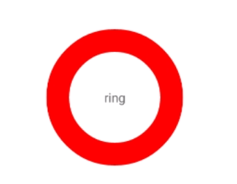
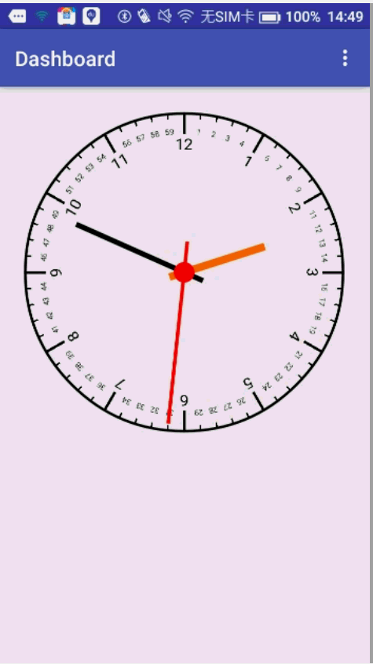

#关于
android进阶所练习的一些例子。

#目录
1. [XML绘图](http://www.jianshu.com/p/5c94914f5ab0)
	1. 
2. [自定义时钟](http://www.jianshu.com/p/7df63512a1b0)
	1. 
3. [轮播图](http://www.jianshu.com/p/04a8bd560160)
	1. 
4. [SafeView](http://www.jianshu.com/p/6a443280c74c)
	1. 
5. [酷炫菜单](http://www.jianshu.com/p/27b7410523a3)
	1. 

[我的简书](http://www.jianshu.com/users/3e53005808b1/latest_articles)

[我的博客](https://aohanyao.github.io/)